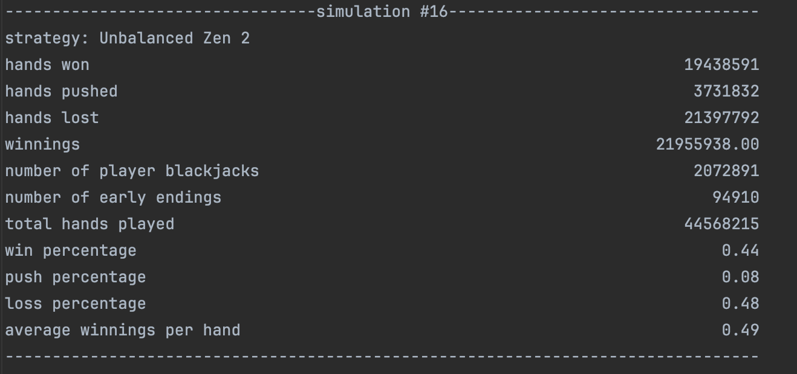

# An Extensible Blackjack Card Counting Simulator
## Description
A program that allows users to configure parameters for a blackjack card counting simulation to test strategies. The project is also a library, with the intent that
others may implement the collection of traits that define a strategy to provide fine grain customization. Potentially allowing users to test novel strategies quickly and easily.
Most of the garden variety counting strategies have already been implemented, and the executable associated with the crate allows the users to test all the garden variety strategies with parameters passed in via the command line.

## Goals
In this project, I wanted to learn how to create interfaces in a library that would allow for customization by others, as well as how to leverage concurrency when running simulations. 

## Usage
To run the executable for this program clone the repository onto your local machine. Since this crate is part of a workspace make sure you are located in the blackjack_sim directory.
Finally, you can run the executable by entering `cargo run --bin blackjack_sim` with your custom arguments for the simulation. A table of configurable command line arguments is below.

| -t | -f | -p | -n | -d | -r | -b | -g | -s | -m | -e | -i |
| --- | --- | --- | --- | --- | --- | --- | --- | --- | --- | --- | --- |
| Sets the blackjack table's starting balance | The file name the output of the simulations will be written to (optional, default is stdout) | The players starting balance | The number of simulations run for each strategy | The number of decks used in the game | The maximum number of hands played for any given simulation | The minumum bet of the table | Flag that determines whether or not to display output from each simulation (optional, defaults to true) | Flag that determines whether the game allows surrender or not | The a constant value margin to increase bets by | Flage that determines whether or not the dealer hits on a soft seventeen (optional, defaults to false) | Flag that determines whether or not the game allows insurance bets to be taken (optional, defaults to false) |

### Example
Lets run a simple example, we will test all strategies via the executable in the crate. We run the following command: `cargo run --bin blackjack_sim -- -t 10000 -f out.txt -p 500 -d 6 -n 500 -r 1000 -b 5 -s -m 2`. We have decided to test all strategies, the table's starting balance will be `$10,000.00`, the output file will be out.txt, the players starting balance for each simulation will be `$500.00`, the number of decks used at the table will be 6,
the number of simulations run per strategy will be 500, the minimum bet will be `$5.00`, the maximum number of hands per strategy will be 1000, we allow surrender and the betting margin (i.e. the amount we increase our bet when the count is positive) will be 2.
Phew... After running the above command we can open up `out.txt` to see the results of our simulations. Some example output is below. Note how the consistantly profitable strategies with the highest winnings per bet are typically Wong's halves, Zen Count or the Unbalanced Zen Count.

